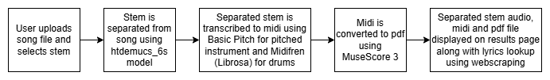
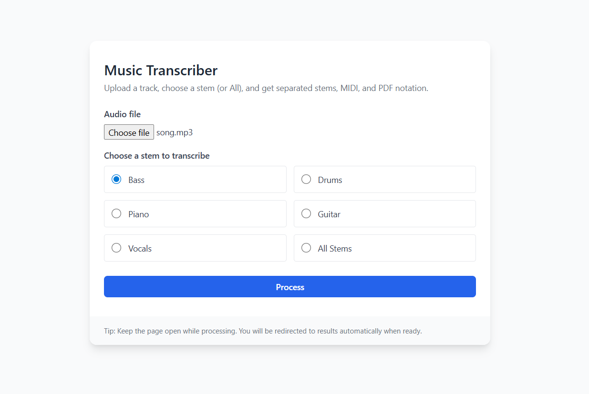
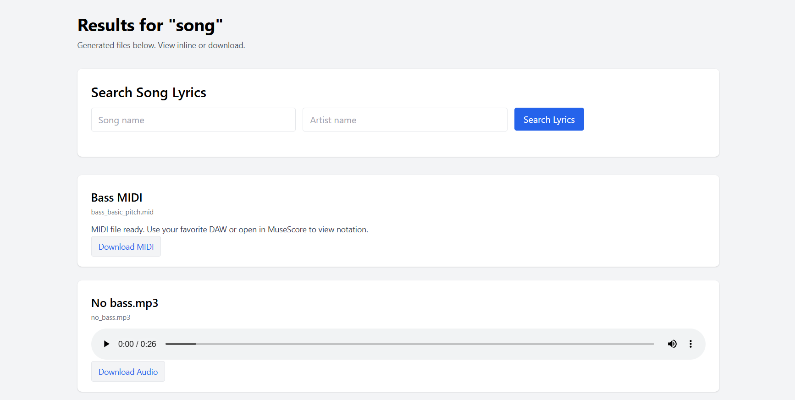

# Music Transcriber App

[](https://hub.docker.com/r/thekaushalk/music-transcriber-app)
[](LICENSE)

Music Transcriber App is a user-friendly Python Flask web application that enables users to upload an audio file (supports `.wav`, `.mp3`, `.flac`, `.ogg`) and extract musical components from it. With this app, you can easily perform source separation—such as isolating guitar—and automatically receive:

- The separated audio track (e.g., guitar only and non-guitar)
- The MIDI file for the separated audio
- The corresponding musical notation as a PDF

This project can be useful to musicians by providing separate instrument tracks, lyrics, midi, as well as the notation of any song. Although the separation or transcription may not be completely accurate, it can definitely serve as a solid point of reference for the musician to get a general idea of the section they wish to practice. They will also be able to play their instrument along with the song after practicing, with the instrument-less part playing on their device (like karaoke but for their instrument instead of vocals).

## Features

- 🎵 **Audio Upload:** Supports common formats like WAV, MP3, FLAC, and OGG.
- 🥁 **Source Separation:** Choose which instrument to extract (e.g., drums), and the app separates out the desired track.
- 🎼 **MIDI & Notation:** Generates a MIDI file and a printable PDF of musical notation for the isolated track.
- 🎤 **Lyrics Lookup:** Fetches lyrics from various sources given song name and artist name.
- 📦 **Containerized Deployment:** Easily run anywhere using Docker.

## Block Diagram

<p align="center">
  
</p>

## Demo





## Getting Started

### Prerequisites

- Docker installed **OR**
- Python 3.11 and requirements in `requirements.txt`
- Download MuseScore 3 and add to path
- Add FFmpeg to path

### Using Docker (Recommended)

```bash
# Pull image from Docker Hub
docker pull thekaushalk/music-transcriber-app

# Run the container
docker run -p 5000:5000 thekaushalk/music-transcriber-app
```

Open [http://localhost:5000](http://localhost:5000) in your browser.

### Manual Setup (Ubuntu Linux)

```bash
git clone https://github.com/thekaushalk/music-transcriber-app.git
cd music-transcriber-app
pip install -r requirements.txt
python app.py
```

Open [http://localhost:5000](http://localhost:5000) in your browser.

## Usage

1. Upload an audio file (`.wav`, `.mp3`, `.flac`, `.ogg`).
2. Choose which instrument to separate (e.g., drums).
3. Click **Transcribe**.
4. Download:
   - The separated audio file (e.g., drums only)
   - MIDI file of the track
   - Printable PDF with musical notation
   - The audio file with the selected instrument removed

## Output Example

For a drum selection:
- `drums.mp3` — Audio file containing only drums
- `drums.mid` — MIDI MIDI file for the drum track
- `drums.pdf` — Musical notation (PDF) of the drum part
- `no_drums.mp3` — Remaining audio with the drums removed


## Contributing

Contributions, bug reports, and feature requests are welcome!

1. Fork the repository
2. Create your feature branch
3. Commit your changes
4. Push to the branch
5. Open a pull request

## 📜 Credits & Licensing

This project uses the following open-source tools and libraries:

---

### **Demucs**
- Music source separation
- © Facebook AI Research  
- **MIT License**  
- https://github.com/facebookresearch/demucs

---

### **Basic Pitch**
- Automatic music transcription  
- © Spotify  
- **MIT License**  
- https://github.com/spotify/basic-pitch

---

### **MidiFren**
- MIDI editing and processing utilities  
- **Apache License 2.0**  
- https://github.com/Omodaka9375/MIDIfren

---

### **MuseScore 3**
- External application used for converting MIDI files to PDF  
- **GPL v2 License**  
- Not distributed or modified by this project  
- https://musescore.org/

---

## 📝 Lyrics Notice

This project includes code capable of fetching lyrics from third-party websites such as **Genius** and **AZLyrics**.

- Lyrics are **copyrighted** by their respective owners.  
- This project does **not** store, publish, or redistribute lyrics.  
- All scraping code is provided strictly for **personal, educational, and research use**.  
- Users are responsible for complying with the Terms of Service of the websites they access.

---

## 📄 Project License

This repository is released under the **MIT License**, unless otherwise noted.  
MIT is fully compatible with all dependencies used in this project.

See the `LICENSE` file for details.

## Links

- [DockerHub Image](https://hub.docker.com/r/thekaushalk/music-transcriber-app)
- [GitHub Repository](https://github.com/thekaushalk/music-transcriber-app)
